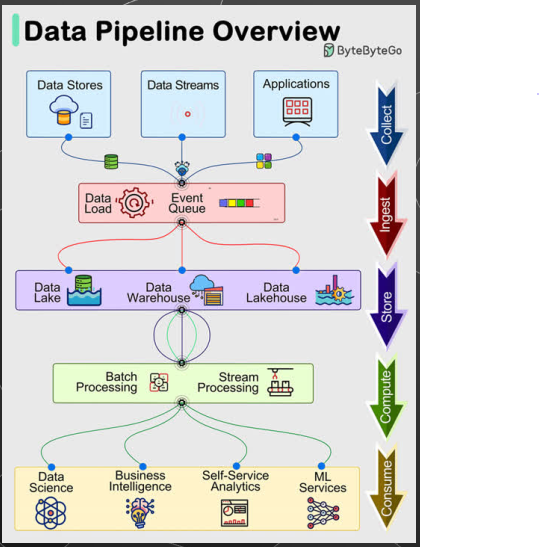
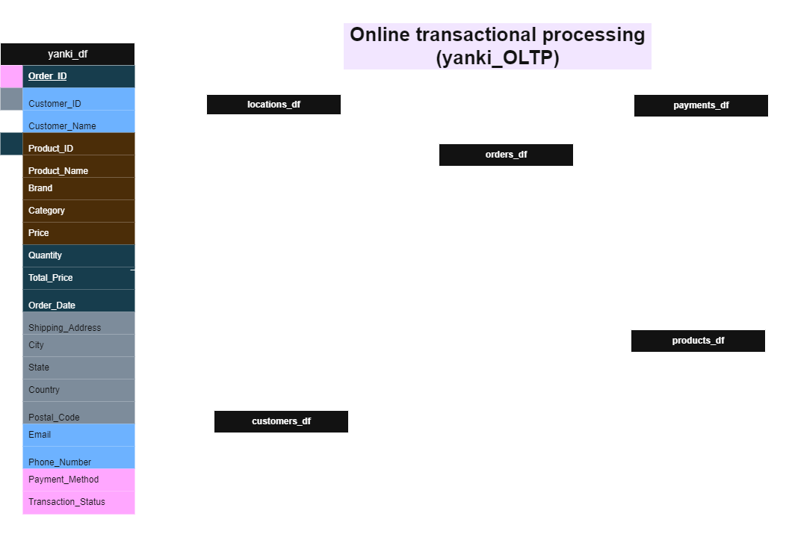
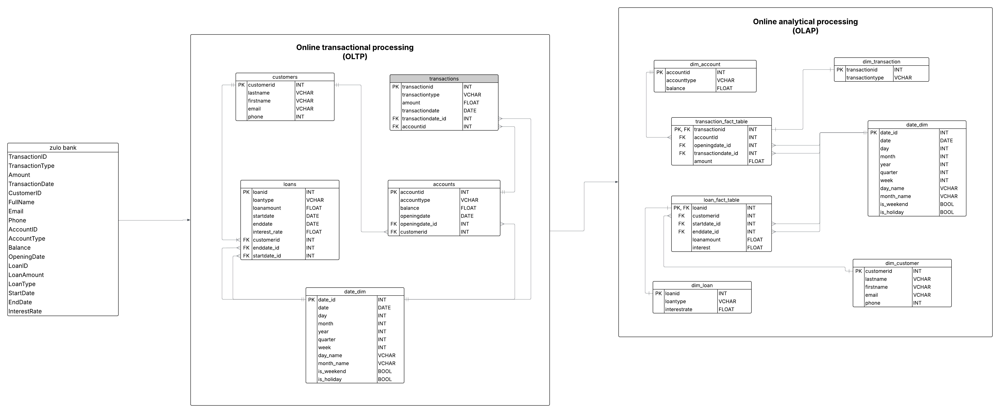
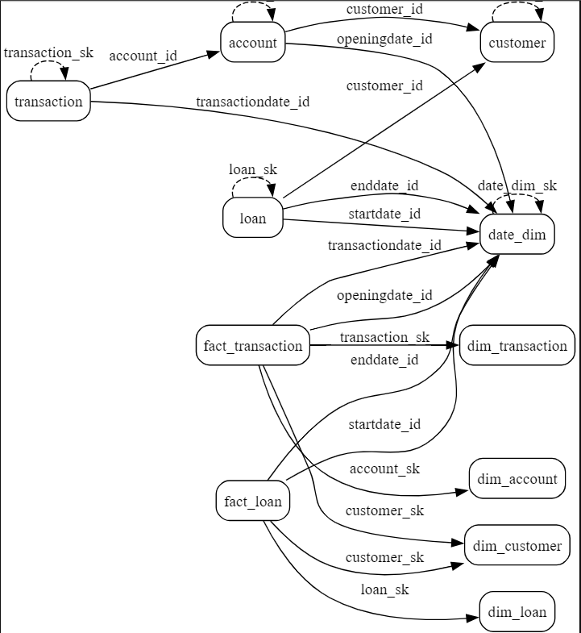

<table>
<tr>
<td></td>
<td><h1><strong>Consolidated Project Documentation: Data Engineering Case Study</strong></h1></td>
</tr>
</table>

<strong>Author: Anthonia</strong>

---
## Table of Contents
- [1. Overview](#overview)
- [2. Project: Unified Data Engineering Pipeline for Banking and Ecommerce](#project-unified-data-engineering-pipeline-for-banking-and-ecommerce)
  - [Objectives](#objectives)
- [3. Business Problem](#business-problem)
- [4. Project Scope](#project-scope)
- [5. 🛠️ Tech Stack](#️-tech-stack)
- [6. Deliverables](#deliverables)
- [7. Dataset Access](#dataset-access)
- [8. Learning Outcomes](#learning-outcomes)
- [9. End_End_Project Workflow](#end_end_project-workflow)
  - [Data Preprocessing (For Database & Warehouse Design)](#data-preprocessing-for-database--warehouse-design)
  - [From OLTP to OLAP: Schema Progression](#from-oltp-to-olap-schema-progression)
  - [Stage 1: OLTP – Normalized Database Design](#stage-1-oltp--normalized-database-design)
  - [Stage 2: OLAP – Star Schema Design for Analytical Reporting](#stage-2-olap--star-schema-design-for-analytical-reporting)
  - [Fact Table Considerations](#fact-table-considerations)

---

## Overview

This consolidated case study aims to provide beginner data engineers with hands-on experience in data modeling, transformation, and engineering through practical tasks using Python, SQL, NumPy, Pandas, and PostgreSQL. The focus is to improve data quality, streamline analytics, and enhance decision-making capabilities in both a banking and ecommerce environment.

---

## Project: Unified Data Engineering Pipeline for Banking and Ecommerce

### Objectives:
1. **Apply Database Design Principles:**
  - Normalize to Third Normal Form (3NF) and denormalize relational schemas for OLAP purpose.
  - Design operational databases and data warehouses.
2. **Develop Model Diagrams (ERDs):**
  - Create logical models to visualize relationships between core entities
  - Build ERDs and schema diagrams.
  - Assess OLTP (normalized) vs. OLAP (denormalized) schema structures and choose appropriately based on operational vs. analytical needs.
3. **Clean and preprocess raw datasets using Python, NumPy, and Pandas.**
4. **Load cleaned data into PostgreSQL.**
5. **Use Git and GitHub for version control.**

---

## Business Problem

Organizations like **Zulo Bank** and **Yanki Ecommerce** struggle with inefficient data systems characterized by:
- **Data redundancy and inconsistency**
- **Poor accessibility for analytics**
- **Lack of streamlined reporting mechanisms**

*The aim is to build scalable, maintainable data models and pipelines to enhance analytics and operational efficiency.*

---

## Project Scope

### 1. Database Design
- Develop a normalized relational database (up to 3NF) for operational use.
- Identify and implement primary and foreign keys.
- Use PostgreSQL for schema implementation.

### 2. Data Warehouse Modeling
- Create a denormalized star schema for analytics.
- Design fact tables (Transactions, Loans) and dimension tables (Customer, Account, Date).

### 3. Data Extraction & Transformation
- Use **Pandas** to extract and clean CSV/gdrive data.
- Apply **NumPy** for advanced array operations and transformations.

### 4. Data Loading
- Load cleaned data into PostgreSQL.
- Create and maintain database schemas aligned with business requirements.

### 5. Version Control
- Use GitHub and GitHub Desktop to manage code versions.
- Perform branching, pushing, pulling, and merging workflows.

*This scope outlines the full data modeling lifecycle — from relational design to warehouse transformation — specific to any operational and analytical needs*

---

## 🛠️ Tech Stack

- **Python** (Pandas, NumPy)
- **PostgreSQL** (PgAdmin for UI)
- **Draw.io / Lucidchart** (for ERDs)
- **GitHub / GitHub Desktop** (for version control)
*This stack supports the complete project lifecycle, from schema design to data warehouse deployment, within the case study.*

---

## Deliverables

- Normalized and denormalized database schemas.
- Star schema for analytics use cases.
- ERD and schema documentation.
- Cleaned and transformed datasets.
- Python scripts for ETL tasks.
- Version-controlled GitHub repository.

---

## Dataset Access

- <a href="https://drive.google.com/file/d/1DdmNsrdBRLfzBdgtvzvFHZ7ejFpLlpwW/view?usp=drive_link" target="_blank">zulo_bank</a>
- <a href="https://drive.google.com/file/d/1lPmrM-4EJLfM14E_3pWF2aLl_Y7HsoHa/view?usp=drive_link" target="_blank">yanki_ecommerce</a>

---

## Learning Outcomes

- Hands-on banking data modeling with real-world structures
- Optimized data architecture balancing normalization for operations and denormalization for analytics (Master database design from OLTP to OLAP.)
- Gain proficiency in NumPy and Pandas for data preprocessing.
- Build and visualize data pipelines.
- Manage collaboration through Git and GitHub.
- Analytics-ready warehouse design enabling insights into customer behavior and financial performance
- Career-building experience aligned with enterprise-level data engineering practices

---

# End_End_Project Workflow

## **Data Preprocessing (For Database & Warehouse Design)** 
Before designing the database and data warehouse schemas, the following minimal preprocessing steps were performed to ensure data quality and model integrity:
|
Step                     | Description                                                                 |
|--------------------------|-----------------------------------------------------------------------------|
| Convert Date Columns     | Standardize `TransactionDate`, `OpeningDate`, `StartDate`, `EndDate` to `YYYY-MM-DD` format. |
| Ensure Correct Data Types| Verify numeric fields (`Amount`, `Balance`, `LoanAmount`, `InterestRate`) are numbers. |
| Clean Obvious Inconsistencies | Remove any corrupted or incomplete rows (e.g., missing critical IDs like `CustomerID`). |
| Normalize Text Fields    | Lowercase and trim key categorical fields like `TransactionType`, `AccountType`, `LoanType`. |
| Validate Key Fields      | Ensure `CustomerID`, `AccountID`, and `LoanID` (where present) are valid and not null. |

---

## From OLTP to OLAP: Schema Progression
**Recommended Order of Operations:**
✅ Step 1–3	Raw → OLTP normalization + schema creation
✅ Step 4–6	Date mapping + loading to OLTP schema
✅ Step 7–8	Build/load dim and fact tables (with SKs)
✅ Step 9 Optimization: indexes, views
✅ Step 10	QA validations and reporting 

## Stage 1: OLTP – Normalized Database Design
*A relational schema is designed to support day-to-day operations, minimise redundancy, and ensure data integrity through normalization up to 3NF*

- **Normalization Process:** To ensure data integrity and eliminate redundancy, the data is normalized through the following stages:
    - *1NF (First Normal Form)*
      > Eliminate repeating groups
      > Ensure all columns contain atomic (indivisible) values
      
    - *2NF (Second Normal Form)*
      > Remove partial dependencies
      > Ensure all non-key attributes depend on the whole primary key

    - *3NF (Third Normal Form)*
      > Eliminate transitive dependencies
      > Ensure all attributes depend only on the primary key

### Create ERD to visualize structure
- 
- 
  
- Implement schema using PostgreSQL in pgAdmin

## Stage 2: OLAP – Star Schema Design for Analytical Reporting
*The normalized data is then transformed into a star schema to support fast querying, aggregation, and dashboarding in a business intelligence environment.*

- Optimize structure for fast querying and analytical reporting

---

## 3. Fact Table Considerations

*Two primary fact tables are proposed for this data warehouse design:*

1. Transactions Fact Table
   > TransactionID, AccountID (FK to Dim_Account), DateID (FK to Dim_Date), TransactionType, Amount
   
2. Loans Fact Table:
    > LoanID, CustomerID (FK to Dim_Customer), StartDateID & EndDateID (FKs to Dim_Date), LoanTypeID(FK), LoanAmount, Interest(calculated field)

*These fact tables capture measurable banking events and connect to relevant descriptive dimensions, enabling robust, multidimensional analysis.*

- **Star Schema (Used)** Fact tables at the center, connected to denormalized dimension tables, prioritizes simplicity and performance
- *Snowflake Schema (Not Used): Further normalizes dimensions into sub-dimensions, Space-efficient but adds complexity*

    
---

  <em>End of Case Study</em>

 
